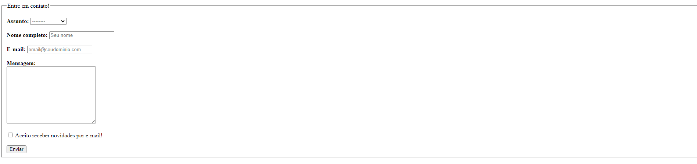

<h1 align="center"> Formulário de Contato </h1>

 

  

## 🚀 Tecnologias

Esse projeto foi desenvolvido com as seguintes tecnologias:

- HTML
- Git e Github

## 💻 Projeto

O Formulário de Contato foi um desafio que me submeti a realizar utilizando o HTML para testar minhas capacidades, confesso que não foi muito desafiador mas tenho como objetivo futuros desafios cada vez mais difíceis!!

- [Acesse o projeto finalizado, online](https://kayanmell0.github.io/formularioDeContato)

- [Acesse as condições do desafio!](https://efficient-sloth-d85.notion.site/2-Formul-rio-de-contato-7bb047fc602f48a1859e02882ddd547b)

## :memo: Licença

Esse projeto está sob a licença MIT.

---